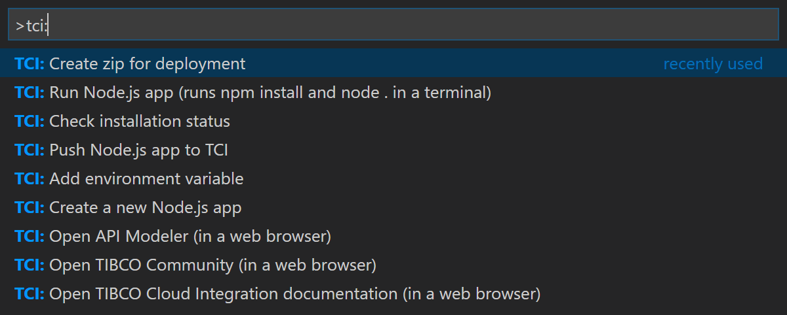

# TCI Tools for Node.js


tci-tools is an extension for Microsoft Visual Studio Code which provides support for building awesome Node.js apps in TIBCO Cloud&trade; Integration. 

## Commands


### Check installation status
This command checks whether or not the `tibcli` utility has been installed on the machine at the location you have configured (see below for details on `extension settings`).

### Open API Modeler (in a web browser)
If you want to build a Node.js app based on an API specification you can use this command to launch the TIBCO Cloud Integration - API Modeler in a browser and visually design the API your Node.js app will expose. You can download a stub implementation from there as well! Based on your setting of the `region` it will open the API Modeler in your TIBCO Cloud region.

### Open TIBCO Community (in a web browser)
The TIBCO Community is a great place to get in contact with experts on TIBCO Cloud Integration. If you have a question, you can post it there too!

### Open TIBCO Cloud Integration documentation (in a web browser)
This command simply launches a browser window and opens the documentation for TIBCO Cloud Integration based on your setting of the `region`.

### Create zip for deployment
You can push a Node.js app to TIBCO Cloud Integration using the `tibcli` or by uploading it through the web. In both cases you'll need a zip file containing the code and the manifest. This command creates a directory `deployment` in which the manifest and zip are placed

### Create a new Node.js app
With TIBCO Cloud Integration you can build Node.js apps from the API specs you design or you can start with the minimum of boilerplate code. This command creates a manifest.json file and a few other files you'll need to create your next Node.js app

### Push Node.js app to TCI
Push your Node.js app to TIBCO Cloud Integration using the `tibcli` utility

### Run Node.js app (runs npm install and node . in a terminal)
Before pushing your app to TIBCO Cloud Integration, you probably want to test it first. This command installs all the dependencies (from package.json) your app relies on and runs your Node.js app on your machine. 

### Add environment variable
Add a new Environment variable to the manifest.json file so you can use it in your Node.js code with the `process.env` context

## Requirements
To use this extension you need a valid account to TIBCO Cloud Integration (you can sign up at https://cloud.tibco.com/free-trial) and the `tibcli` utility (see https://integration.cloud.tibco.com/docs/getstarted/installation/download-tools.html for details)

## Extension Settings
This extension contributes the following settings:
* `tci.tibcli`: The full qualified path to the tibcli executable (including .exe on Windows) which is set to `c:/tmp/tibcli.exe` by default
* `tci.region`: The region of TCI your account is in (e.g. us, eu or au) which defaults to `us`

## Installing the extension
To install the extension you can download the latest version from the [releases](https://github.com/TIBCOSoftware/vscode-extension-tci/releases) section. You can install the extension using the VS Code --install-extension command line switch
```
code --install-extension tci-tools-x.x.x.vsix
```
_Note that you'll have to make sure that `code` is added to your path so you can use it from the console. You can find instructions on how to do that in the [VSCode docs](https://code.visualstudio.com/docs/setup/setup-overview)_

## Building or contributing
If you want to contribute to the extension or build your installer from the source, check out our [docs](docs/build-and-contribute.md)

## Supported systems
This release has been tested on Microsoft Windows 10 (with PowerShell) and macOS 10.13 (with Bash) and VSCode 1.18

## Questions?
Feel free to open a Github issue or ask a question on the [TIBCO Community](https://community.tibco.com)

## Other TIBCO Cloud Integration repos
You might also want to visit our other repos
* [tci-awesome](https://github.com/TIBCOSoftware/tci-awesome), a curated set of awesome projects built on TIBCO Cloud Integration
* [Connectors for TIBCO Business Studio - Cloud Edition](https://github.com/TIBCOSoftware/tci-studio-samples)
* [tci-webintegrator](https://github.com/TIBCOSoftware/tci-webintegrator), the SDK to build cool extensions for our Web Integrator
* [Command Line Interface for Node.js](https://github.com/TIBCOSoftware/tibcli-node)

## Contributors
[Leon Stigter](https://github.com/retgits)

## Release Notes
See the [release notes](docs/release-notes.md) in the docs folder

## License
Copyright © 2017. TIBCO Software Inc.
This file is subject to the license terms contained
in the license file that is distributed with this file.
