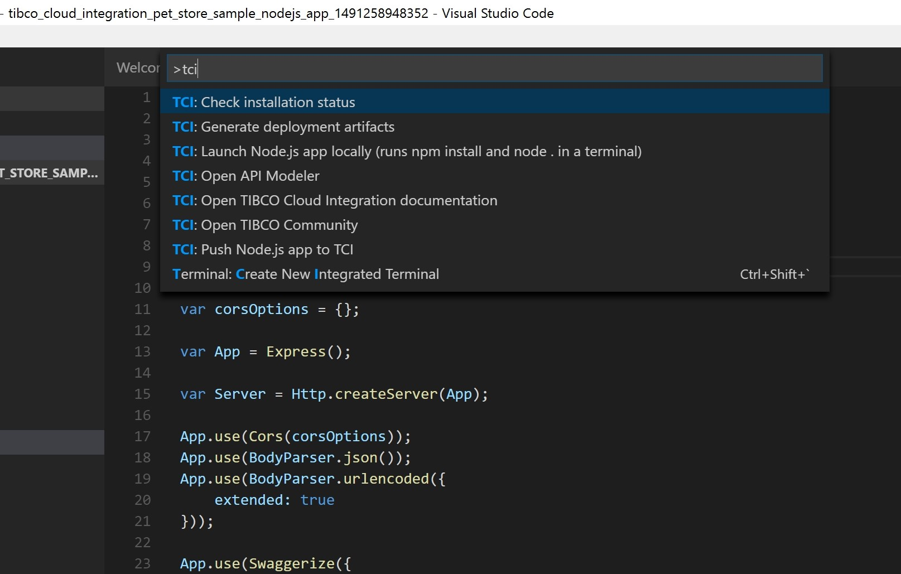

# tci-tools

Out of the box support for TIBCO(R) Cloud Integration right in VSCode

## Features

### Check installation status
This command checks whether or not the `tibcli` utility has been installed on the machine at the location you have configured (see below for details on `extension settings`).

### Other available commands


* __Check installation status__: Check whether the `tibcli` utility exists in the location you have specified
* __Open API Modeler__: Launch the TIBCO Cloud Integration - API Modeler in a browser
* __Generate deployment artifacts__: Create the manifest and zipfile to be deployed to TIBCO Cloud Integration
* __Push Node.js app to TCI__: Not only create the manifest and zipfile, but push it to TIBCO Cloud Integration as well
* __Launch Node.js app locally (runs npm install and node . in a terminal)__: Install dependencies (from package.json) and run your Node.js app locally to test 
* __Open TIBCO Community__: Launch the TIBCO Community in a browser
* __Open TIBCO Cloud Integration documentation__: Launch the TIBCO Cloud Integration documentation in a browser

## Requirements

In order to use this plugin you would need a valid account to TIBCO Cloud Integration (you can sign up at https://cloud.tibco.com/free-trial) and the `tibcli` utility (see https://integration.cloud.tibco.com/docs/getstarted/installation/download-tools.html for details)

## Extension Settings

This extension contributes the following settings:

* `tci.tibcli`: The full qualified path to the tibcli executable (including .exe on Windows) which is set to `c:/tmp/tibcli.exe` by default

## Installing the extension

You can install the extension using the VS Code --install-extension command line switch
```
code --install-extension tci-tools-0.0.2.vsix
```

## Known Issues

This release has been tested on Microsoft Windows 10 (with PowerShell) and macOS 10.12 (with Bash)

## Questions?
Feel free to open a Github issue or ask a question on the [TIBCO Community](https://community.tibco.com)

## Contributors
[Leon Stigter](https://github.com/retgits)

## Release Notes

### 0.0.2
Added support for macOS 10.12 (Sierra)

### 0.0.1
Initial release of tci-tools on Windows

## License
Copyright © 2017. TIBCO Software Inc.
This file is subject to the license terms contained
in the license file that is distributed with this file.