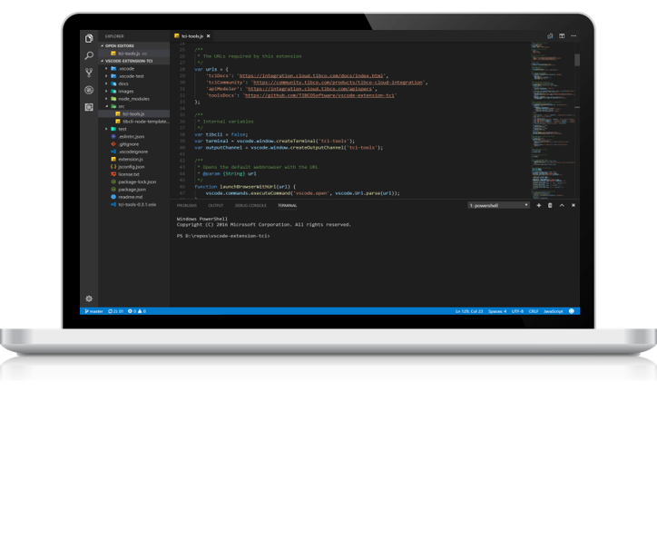

<section id="tci">

<article class="container-fluid">

# Node.js tools to make your life easy

# VSCode

#### An extension for Microsoft Visual Studio Code which provides support for building awesome Node.js apps in TIBCO Cloud™ Integration.

[More information](#info) [Install VSCode Extension](https://github.com/TIBCOSoftware/vscode-extension-tci/releases)

# Command Line

#### The CLI to build code in the way you want and with the tools that you like best for Node.js apps in TIBCO Cloud™ Integration!

[More information](#info) [Install tibcli-node](https://github.com/TIBCOSoftware/tibcli-node/releases)

</article>

</section>

<section id="tci-tools">

<article class="container-fluid">

# Node.js Tools for TCI

 

[

#### Generate Node.js apps

](#)

Generate Node.js apps with no boiler plate code at all (just the required files for TIBCO Cloud Integration) and develop apps with the tools and workflows that you like!

 

[

#### Update the manifest

](#)

Add a new Environment variable to the manifest.json file so you can use it in your Node.js code with the process.env context to follow the best practices of Node.js development.

 

[

#### Create deployment files

](#)

You can push a Node.js app to TIBCO Cloud Integration using the tibcli or by uploading it through the web. In both cases you'll need a zipfile containing the code and the manifest, both tools will help you do that!

 

[

#### Push to Cloud

](#)

Push your Node.js app to TIBCO Cloud Integration and your apps on a world class integation Platform as a Service together with many other app types!

[Install VSCode Extension](https://github.com/TIBCOSoftware/vscode-extension-tci/releases) [Install tibcli-node](https://github.com/TIBCOSoftware/tibcli-node/releases)

</article>

</section>